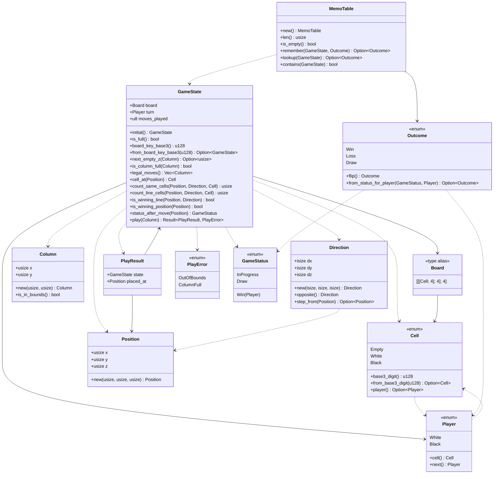
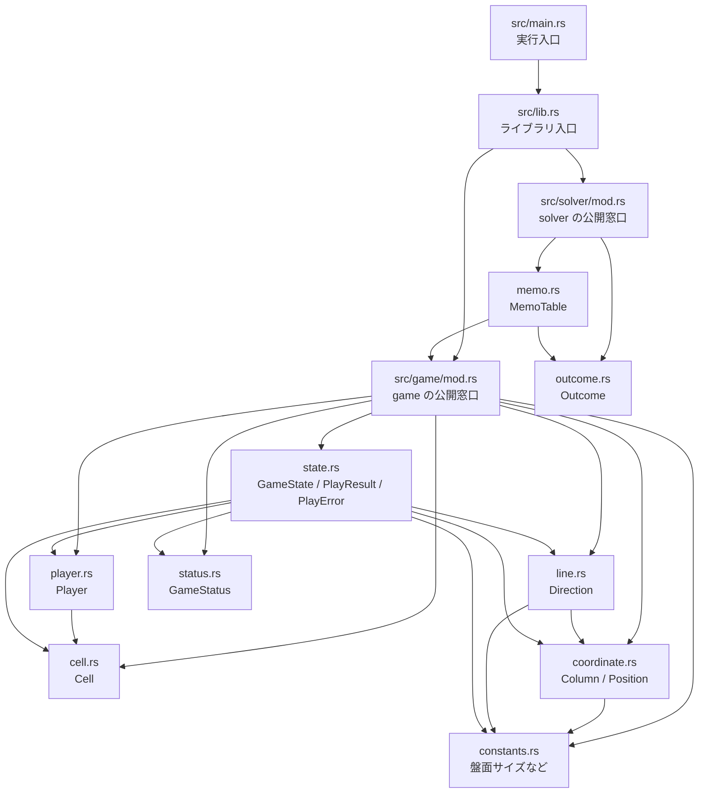
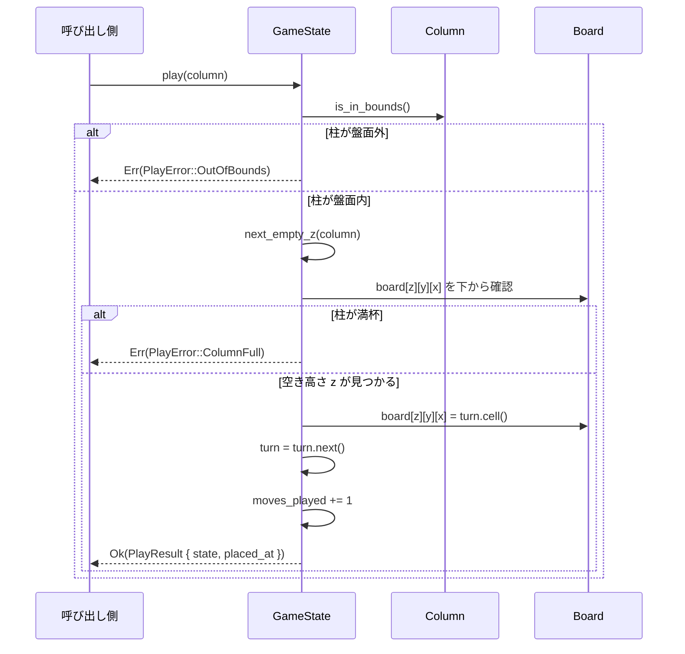
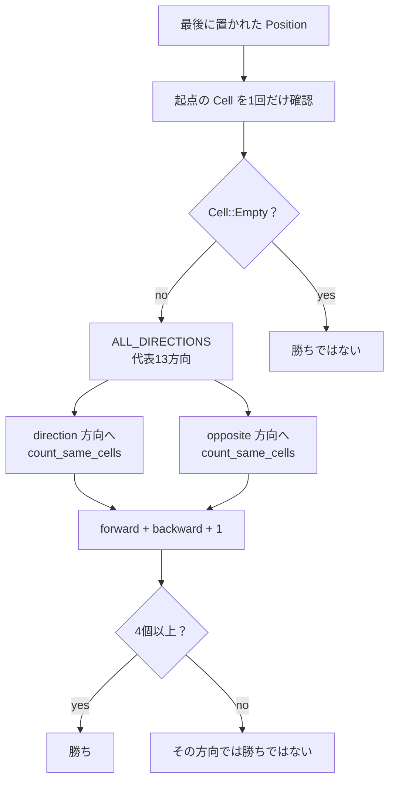
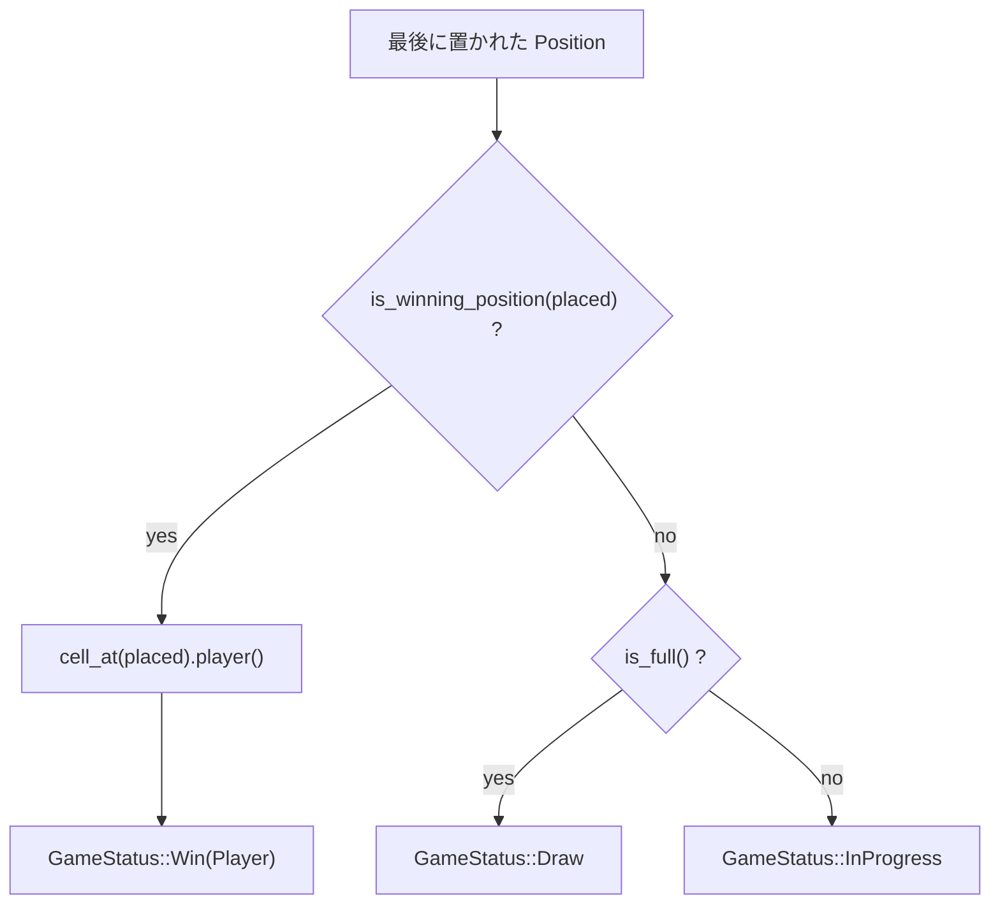
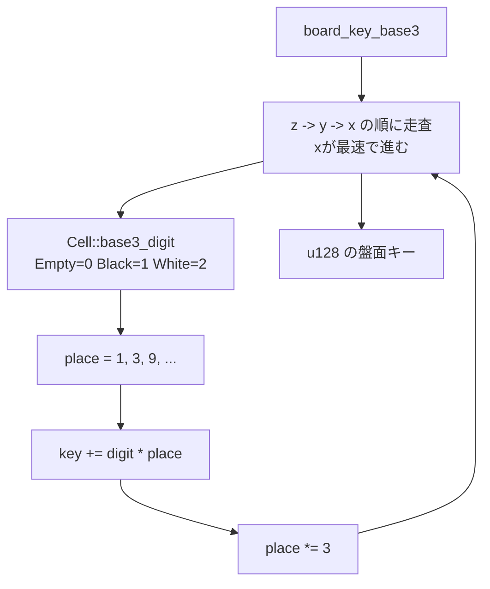
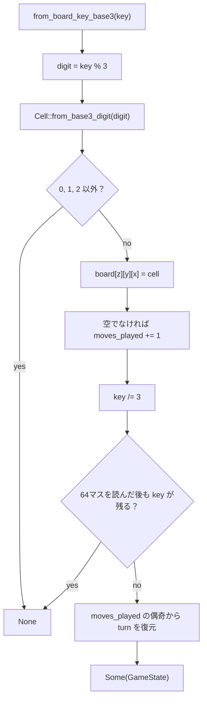
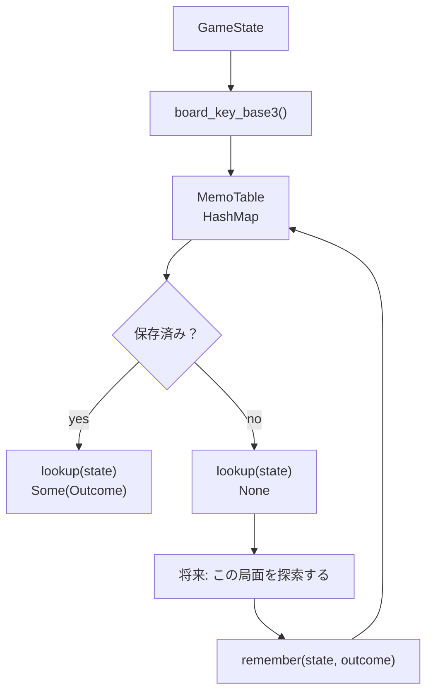
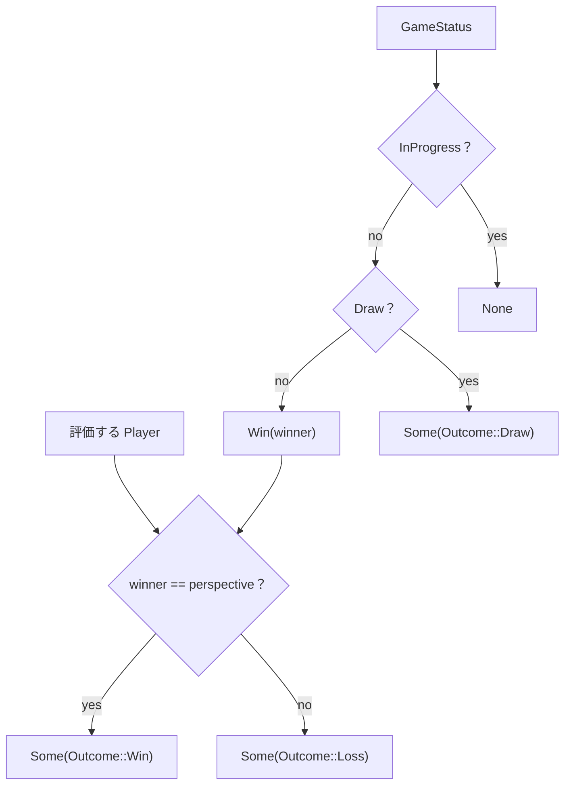
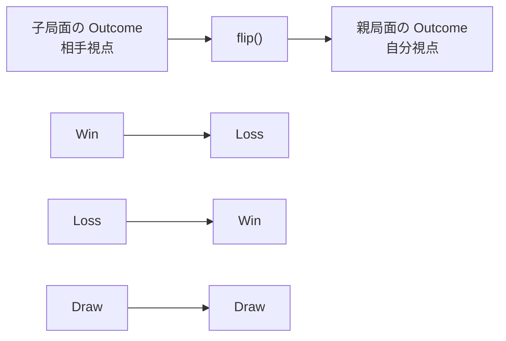

# UML / Mermaid 図

## この文書の目的

この文書では、現在のコード構造を Mermaid 図で可視化します。

Rust でも UML のような設計図を Markdown に残せます。ここでは厳密な UML 記法にこだわりすぎず、学習用に「型同士の関係」「モジュールの依存」「処理の流れ」が分かることを優先します。

GitHub や Mermaid 対応エディタでは、以下のコードブロックが図として表示されます。

## 型の関係

## モジュールの関係

## 着手処理の流れ

## 勝敗判定へ進むための流れ

この最後の図の流れは、`GameState::is_winning_position` として実装済みです。次はこの判定を使って、ゲーム全体が進行中・勝ち・引き分けのどれかを表す型へ進みます。

位置ごとに「この方向では4つ並びようがない」と分かる場合、その方向を事前に省く最適化も考えられます。ただし、今は勝敗判定の正しさと理解しやすさを優先し、その最適化は後回しにします。

## ゲーム状態の判定

この図の流れは、`GameState::status_after_move` として実装済みです。

勝敗判定のテストでは、通常の `play` で作る局面に加えて、盤面を直接組み立てるテストも使います。重力ありルールでは斜め方向の特定配置を合法手だけで作る準備が複雑になるため、勝敗判定ロジック単体を確認したい場合は直接盤面を作ります。

## 盤面キーの生成

最初のマス `(0, 0, 0)` は3進数の最下位桁として扱います。走査順は `(0,0,0)`, `(1,0,0)`, ..., `(3,3,0)`, `(0,0,1)`, ... です。

## 盤面キーからの復元

復元処理は、保存したキーを再び `GameState` として扱うための準備です。ただし、現在の `from_board_key_base3` は重力に反していないか、黒白の個数が合法かまでは検証しません。初期状態から `play` で作った局面を保存し、そのキーを読み戻す用途を想定しています。

## メモ化の最小単位

メモ化は「同じ局面をもう一度調べない」ための仕組みです。現在は探索本体をまだ実装せず、`MemoTable` で盤面キーと `Outcome` を保存・取得するところだけを確認します。

## GameStatus から Outcome への変換

`GameStatus` は「ゲームとしてどうなっているか」を表し、`Outcome` は「指定したプレイヤーから見てどうか」を表します。そのため、勝ち状態を `Outcome` に変換するときは、勝者と評価するプレイヤーを比較します。進行中の状態はまだ探索結果ではないので `None` にします。

## Outcome の視点反転

自分が1手打った後の局面は相手番です。その子局面を解いて返ってくる `Outcome` は相手から見た結果なので、親局面で読むときは `flip()` で視点を戻します。
