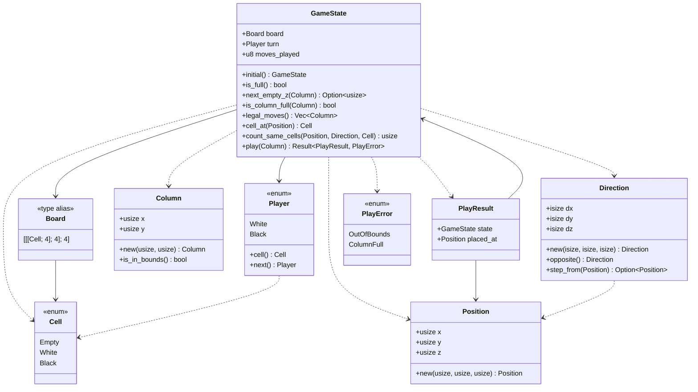
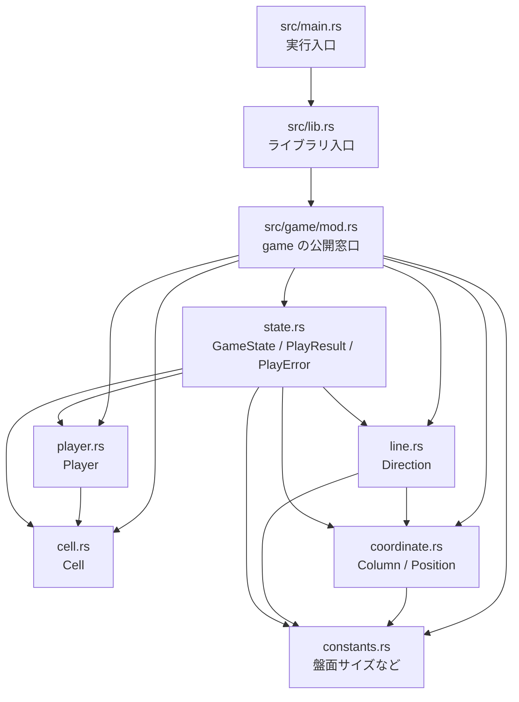
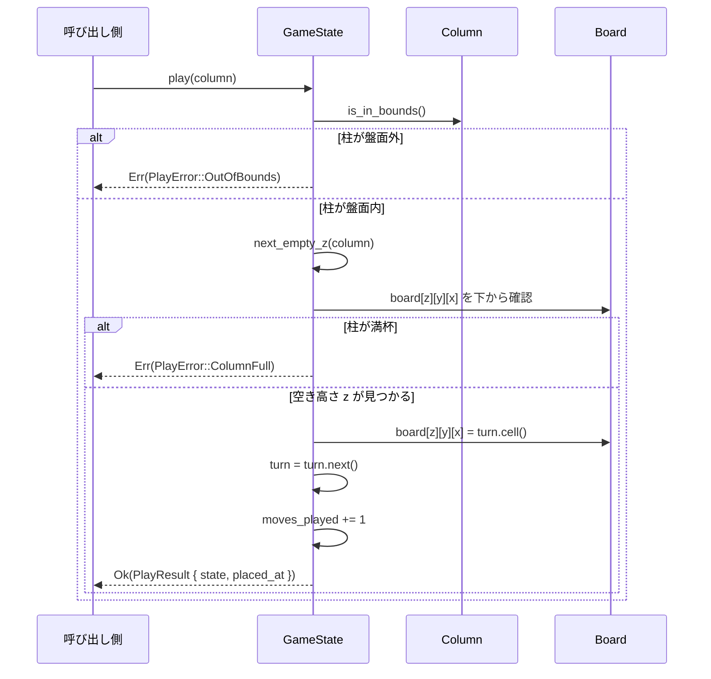
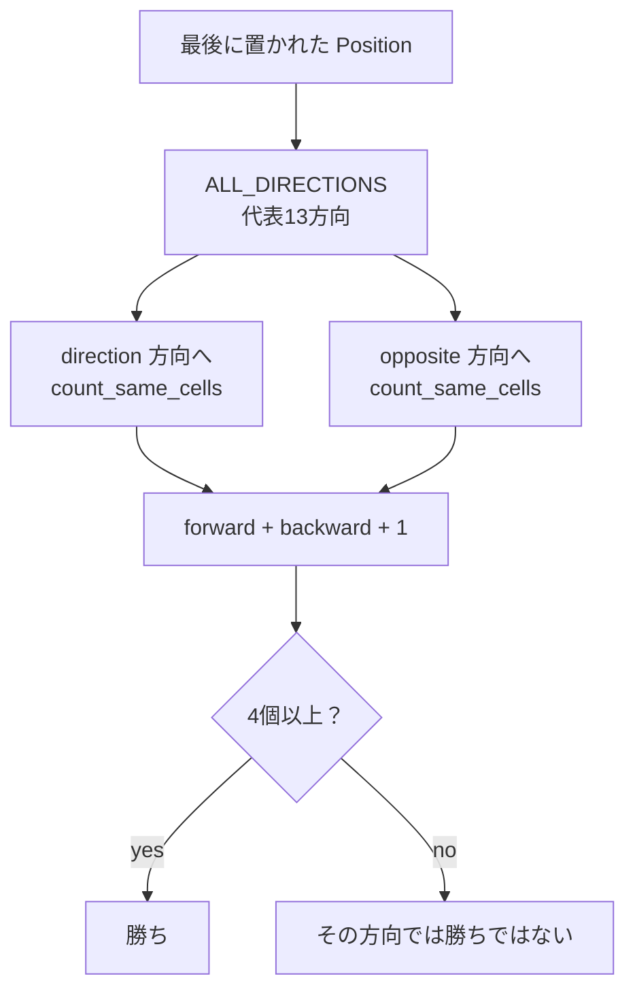

# UML / Mermaid 図

## この文書の目的

この文書では、現在のコード構造を Mermaid 図で可視化します。

Rust でも UML のような設計図を Markdown に残せます。ここでは厳密な UML 記法にこだわりすぎず、学習用に「型同士の関係」「モジュールの依存」「処理の流れ」が分かることを優先します。

GitHub や Mermaid 対応エディタでは、以下のコードブロックが図として表示されます。

## 型の関係

## モジュールの関係

## 着手処理の流れ

## 勝敗判定へ進むための流れ

この最後の図は、まだ完全には実装していない次の段階を表します。現在は `count_same_cells` まで実装済みなので、次は正方向と逆方向を合計して4個以上か判定します。
